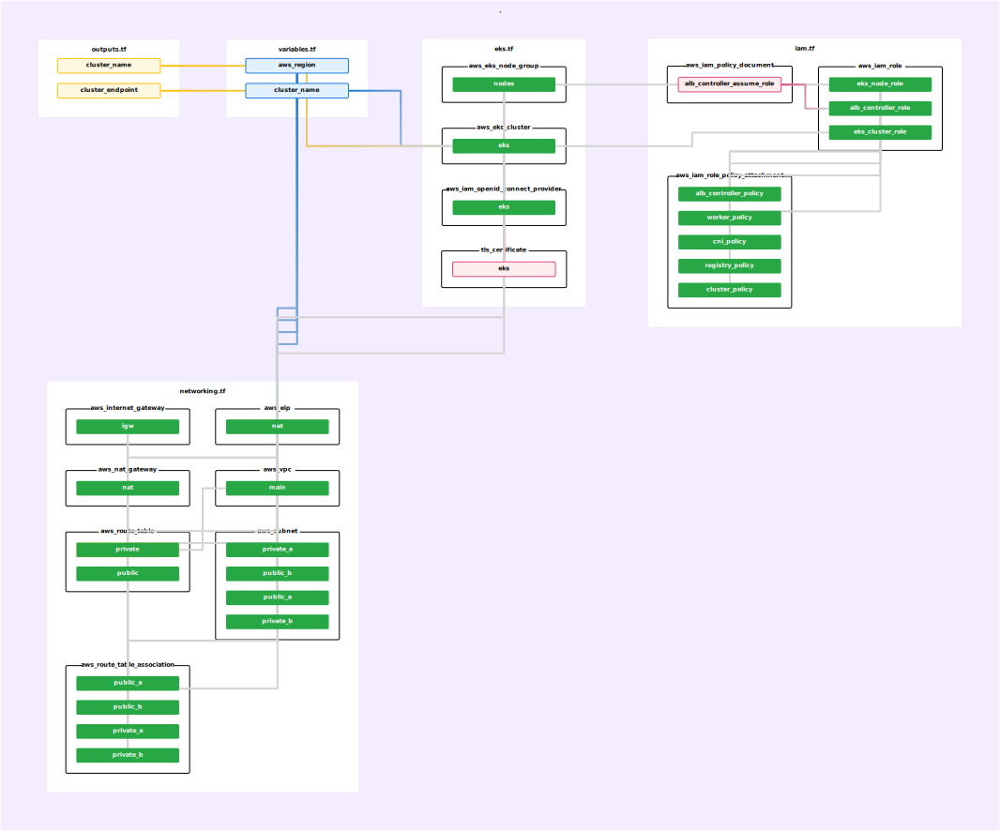
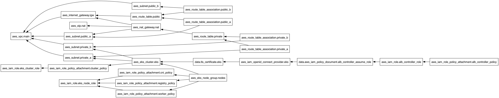

Disclaimer

This repository demonstrates a production-like DevOps setup for portfolio purposes. It does NOT represent any real customer or company infrastructure.
All values, names and configurations are generic examples.

# IaC/GitOps demo project

In this project I'm using AWS EKS with Terraform.

To avoid unnecessary cloud costs, the infrastructure is **not** actively deployed on AWS.

Tip: The Terraform architecture has been visualized using two different approaches to improve transparency and dependency understanding.

# Run the app locally

https://github.com/nbiuk-devops-lab/laravel-application

Please follow the readme.md in the project repo